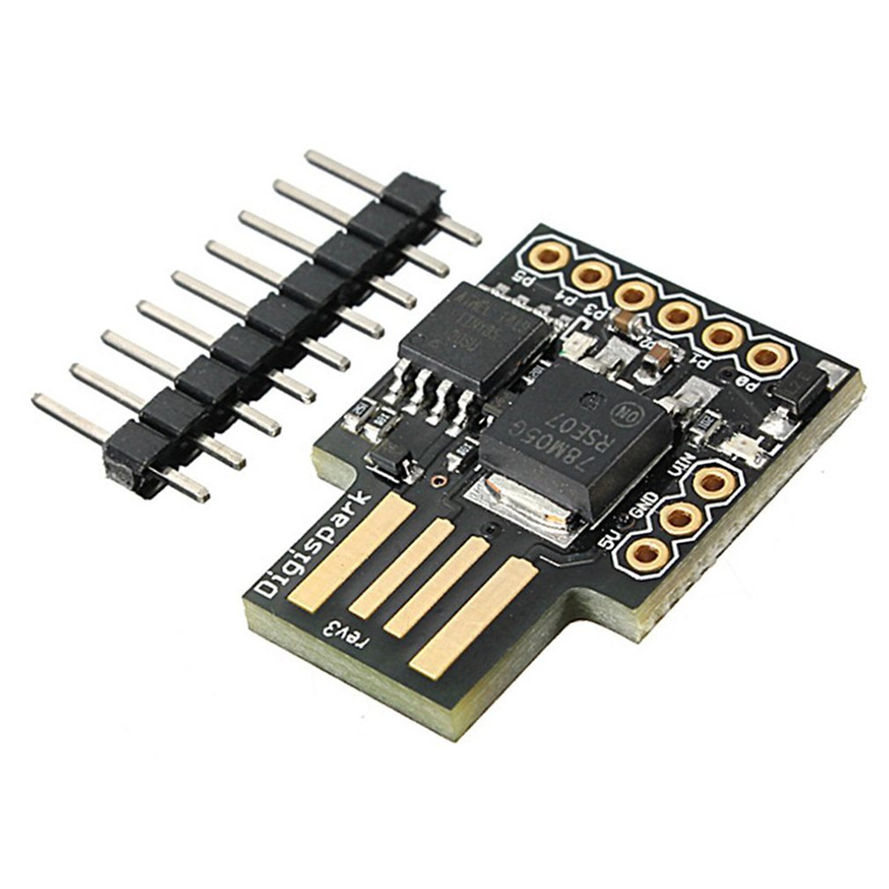

# Aura Magic Credential

A simple password inserter using HID (independing on operating systems).

## Hardware

It runs on disigpark's attiny85 board.  
(Available on Amazon, Aliexpress, …)



## Usage

### Register password

Open "magic_credential/password.h" and write your password.

```c++ magic_credential/password.h
const String PASSWORD = WRITE_YOUR_PASSWORD_HERE;
```

### Compile

1. Setup digispark developing environment on Arudino IDE.
2. Build magic_credential/magic_credential.ino
3. Write binary on the board.

### Use

1. Click the form which you want to enter the password.
2. Insert the board into an USB port.  

After several seconds, the board automatically enter your password and return key.  
Then you can eject the board.